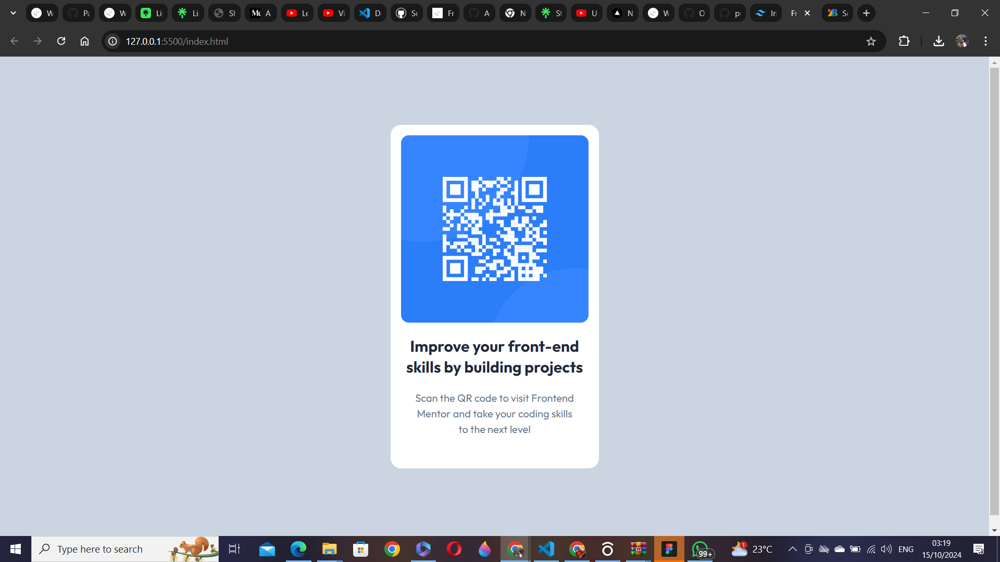
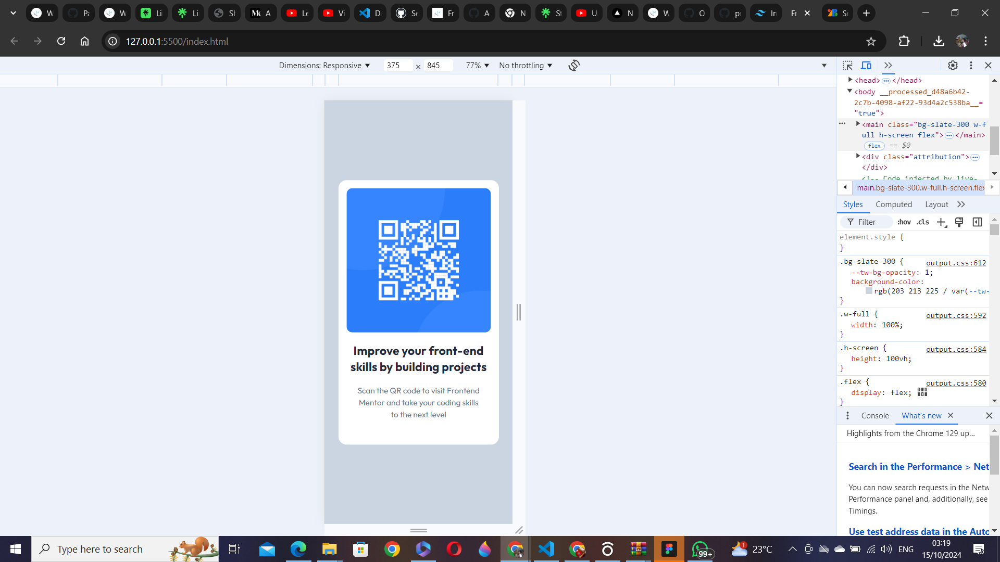

# Frontend Mentor - QR code component solution

This is a solution to the [QR code component challenge on Frontend Mentor](https://www.frontendmentor.io/challenges/qr-code-component-iux_sIO_H). Frontend Mentor challenges help you improve your coding skills by building realistic projects. 

## Table of contents

- [Overview](#overview)
  - [Screenshot](#screenshot)
  - [Links](#links)
- [My process](#my-process)
  - [Built with](#built-with)
  - [What I learned](#what-i-learned)
  - [Continued development](#continued-development)
  - [Useful resources](#useful-resources)
- [Author](#author)
- [Acknowledgments](#acknowledgments)

## Overview

### Screenshot

### Links

- Solution URL: [Add solution URL here](https://your-solution-url.com)
- Live Site URL: [Add live site URL here](https://your-live-site-url.com)

## My process

### Built with

- Semantic HTML5 markup
- CSS custom properties
- Flexbox
- CSS Grid
- Mobile-first workflow
- [Tailwind CSS](https://reactjs.org/) - Post CSS Styles

### What I learned

This was a real walk-over, took me less than 30mins

## Author

- Website - [Stallion](https://linktr.ee/thathorserep.com)
- Frontend Mentor - [@ThatHorseRep](https://www.frontendmentor.io/profile/ThatHorseRep)
- Twitter - [@ThatHorseRep](https://www.twitter.com/ThatHorseRep)
- Telegram - [@ThatHorseRep](https://t.me/ThatHorseRep)
- GitHub - [@ThatHorseRep](https://github.com/ThatHorseRep)